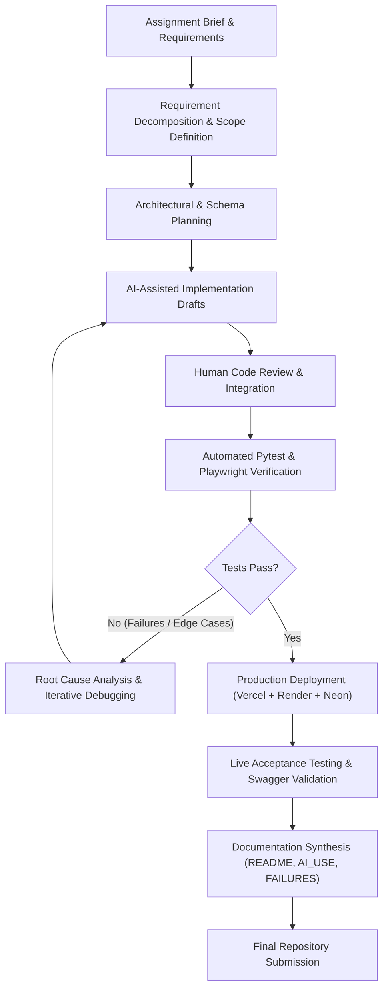

# AI-Assisted Development Disclosure

This document provides a transparent, factual overview of how AI-assisted tools and human-directed engineering were combined to build the **Canonical Clinical Intelligence Platform** (Project 3 — Canonical Medical Record Structuring Pipeline).

Development was conducted through an iterative engineering workflow. AI tools were employed for reasoning, architectural planning, code implementation assistance, test generation, debugging, and documentation synthesis. All AI-generated suggestions and code drafts were systematically reviewed, adapted, executed, and verified against the assignment specifications, test suites, and runtime production behavior.

---

## 1. Development Approach

### Step 1 — Understanding the Assignment
The development process began with an in-depth analysis of the Project 3 requirements defined in the assessment brief (*AI-ML-Internship-Assessment-Projects.pdf*). The assignment was decomposed into concrete engineering requirements:

- Ingestion of multi-document clinical PDFs with mixed layouts and page counts (including 30+ page records).
- Automated document segmentation and page classification across diverse clinical document types.
- Duplicate detection, draft form identification, and blank page elimination.
- Granular clinical entity extraction (demographics, encounters, conditions, medications, allergies, procedures, observations).
- Standard terminology normalization (**ICD-10-CM, RxNorm, LOINC, CPT, UCUM**) with confidence scoring and unmapped concept handling.
- Deterministic deduplication and transparent conflict resolution policies (identity consensus voting, laterality discordance, temporal stratification).
- Complete field-level provenance tracking linking facts back to source documents, page numbers, and text snippets.
- Validated **HL7 FHIR R4 Bundle** generation with formal schema compliance.
- Queryable relational persistence supporting complex clinical inquiries.
- Quantitative evaluation comparing the canonical pipeline against a Naive Baseline and a hand-verified 110-case terminology benchmark.

AI-assisted reasoning was utilized to structure and clarify these requirements, while the final implementation scope was rigorously benchmarked against the assessment specification.

---

## 2. System Architecture and Planning

Before writing implementation code, the project's end-to-end architecture was designed iteratively:

$$\text{Client SPA (Vercel)} \longrightarrow \text{FastAPI REST Router (Render)} \longrightarrow \text{12-Stage Pipeline Services} \longrightarrow \text{Relational Store (Neon PostgreSQL / SQLite)}$$

AI assistance was utilized during architectural planning for:
- Brainstorming pipeline service decomposition and data models.
- Analyzing data flow between ingestion, classification, segmentation, extraction, normalization, deduplication, conflict resolution, and FHIR construction.
- Designing normalized relational database schemas (`patients`, `encounters`, `conditions`, `medications`, `allergies`, `procedures`, `observations`, `conflicts`, `review_queue`).
- Designing FastAPI REST API contracts and request/response schemas.
- Mapping dependencies across pipeline stages to ensure deterministic execution.

The final modular architecture was selected and refined based on performance, clinical auditability, and assignment requirements.

---

## 3. Implementation Assistance

AI-assisted coding tools were utilized throughout the implementation phase for tasks including:

- **Code Scaffolding**: Generating initial boilerplates for SQLAlchemy models, Pydantic schemas, and FastAPI routers.
- **Service Drafts**: Creating initial implementation drafts for PyMuPDF layout parsing, regex pattern matchers, and terminology lookup tables.
- **Frontend Logic**: Structuring the vanilla JavaScript Single Page Application (SPA), state management, DOM rendering routines, and CSS layout components.
- **Test Generation**: Drafting Pytest test cases and assertion helpers across individual pipeline services.
- **Error Handling**: Formulating structured exceptions, fallback handling, and HTTP error responses.

**Standard of Review**:
Generated code and suggestions were treated strictly as implementation drafts. Every component was reviewed, adapted, and modified based on actual project behavior, test execution results, and integration requirements.

---

## 4. Iterative Development and Debugging

A central aspect of development involved identifying, debugging, and resolving real integration and runtime challenges:

### 1. Frontend API Routing & Cross-Origin Configuration
- **Challenge**: The frontend Single Page Application initially routed API requests to the Vercel hosting domain rather than the backend service, causing HTTP 404 errors on `/api/process` and related routes.
- **Investigation**: Traced API URL resolution in `frontend/js/app.js` and inspected browser network logs.
- **Resolution**: Implemented dynamic environment detection in `app.js` and configured `API_BASE_URL` to route requests to the live Render FastAPI backend (`https://canonical-clinical-intelligence.onrender.com`) with appropriate CORS headers in `backend/app/config.py`.

### 2. Database Foreign-Key Resolution & Idempotency
- **Challenge**: Repeated pipeline execution on the same database instance triggered foreign-key constraint violations when deleting or re-inserting related clinical entities (e.g. encounters referencing patient records). Additionally, single-document records with differing ID conventions caused foreign-key lookup misses.
- **Investigation**: Analyzed SQLAlchemy transactional error logs and examined the deletion and insertion order in `backend/app/db/repository.py`.
- **Resolution**: Refactored `save_pipeline_result` to clear existing records in reverse dependency order (`review_queue` $\rightarrow$ `conflicts` $\rightarrow$ `observations` $\rightarrow$ `procedures` $\rightarrow$ `allergies` $\rightarrow$ `medications` $\rightarrow$ `conditions` $\rightarrow$ `encounters` $\rightarrow$ `document_pages` $\rightarrow$ `documents` $\rightarrow$ `patients`), resolved patient foreign keys with safe fallbacks, and validated that pipeline re-runs are fully idempotent.

### 3. Production Deployment Verification
- **Challenge**: Ensuring seamless interoperability across a three-tier decoupled cloud deployment (Vercel + Render + Neon PostgreSQL).
- **Resolution**: Verified runtime environment variables (`DATABASE_URL`, `ALLOWED_ORIGINS`, `API_BASE_URL`), tested live database connection pooling with SSL, and validated live API health endpoints.

---

## 5. Testing and Verification

AI tools assisted in drafting test routines, while actual verification was established through deterministic execution:

- **Pytest Test Suite**: **24 passed tests** in [`backend/tests/`](backend/tests/) covering:
  - 30+ page compliance dataset processing (`test_30plus_compliance.py`)
  - End-to-end REST API endpoints (`test_api.py`)
  - Page classification accuracy (`test_classifier.py`)
  - Conflict resolution and demographic isolation (`test_conflict_resolver.py`)
  - Exact and metadata duplicate detection (`test_duplicate_detector.py`)
  - Clinical entity extraction and provenance (`test_extractor.py`)
  - HL7 FHIR R4 schema validation (`test_fhir.py`)
  - Multi-page document continuation and generalization (`test_generalization.py`)
  - PyMuPDF ingestion and layout extraction (`test_ingestion.py`)
  - Terminology normalization across 5 systems (`test_normalizer.py`)
  - Relational clinical queries (`test_queries.py`)
  - Document boundary segmentation (`test_segmenter.py`)
  - 110-case hand-verified terminology benchmark (`test_terminology_eval.py`)
- **Frontend Syntax & Quality**: Validated using Node.js syntax checks (`node -c frontend/js/app.js` $\rightarrow$ 0 errors).
- **Playwright Browser Automation**: Executed headless browser test scripts to verify live UI tab navigation, query console rendering, clipboard copying, and button state transitions.
- **Production Verification**: Confirmed live health check (`https://canonical-clinical-intelligence.onrender.com/health`) and Swagger UI docs.

---

## 6. AI Use in Frontend Development

AI assistance was utilized to support the frontend design and interactive features:

- **Design System & Component Styling**: Translating clinical dashboard requirements into a clean, modern vanilla CSS design system with glassmorphic cards, clear typography, and accessible badges.
- **State & DOM Management**: Structuring modular JavaScript controllers in `app.js` for pipeline execution tracking, tab switching, and master-detail document viewing.
- **Query Console Copy Feature**:
  1. Located the Query Output container and badge elements in `app.js`.
  2. Implemented clipboard copy logic using `navigator.clipboard.writeText` with fallback to a hidden textarea `execCommand('copy')`.
  3. Added immediate UI feedback transitioning the button label to `Copied ✓`.
  4. Implemented a 2000ms timer reset returning the button to `Copy`.
  5. Verified the functionality through automated Playwright end-to-end tests comparing clipboard payloads to displayed DOM JSON.

---

## 7. AI Use in Documentation

AI tools assisted in synthesizing and structuring technical documentation:

- Structuring `README.md` into an evaluator-grade document with clear headings, badges, and code blocks.
- Generating Mermaid workflow and architecture diagrams.
- Creating the requirement traceability matrix mapping assignment specifications to code modules.
- Compiling the failure analysis and engineering learnings in `FAILURES.md`.

**Source of Truth Policy**:
All documented figures, test counts (24/24), dataset statistics (22-page primary, 32-page compliance), ontology numbers (110-case benchmark), and deployment URLs were drawn directly from actual code files, database schemas, and runtime logs.

---

## 8. Human Review and Engineering Responsibility

The engineering direction, architectural decisions, and verification remained the responsibility of the developer throughout the project lifecycle:

- **Requirement Interpretation**: Reading and analyzing the assessment brief to establish mandatory deliverables versus optional enhancements.
- **Architectural Authority**: Deciding on decoupled services, relational database storage, and deterministic heuristic/consensus algorithms rather than unconstrained LLM calls.
- **Code Review & Refinement**: Inspecting every AI-generated suggestion, removing erroneous assumptions, and adapting logic to project constraints.
- **Debugging & Root-Cause Analysis**: Diagnosing regex multiline bleeding, legal watermark collisions, and database foreign-key issues.
- **Test & Validation Execution**: Running test suites, verifying pass rates, and confirming that acceptance criteria were met.
- **Deployment Management**: Configuring and maintaining Vercel frontend, Render backend, and Neon PostgreSQL database infrastructure.

---

## 9. Tools Used

| Tool / Category | How It Was Used |
| :--- | :--- |
| **AI Reasoning Assistant** | Requirements breakdown, architectural brainstorming, documentation synthesis, and debugging assistance. |
| **AI Coding Environment** | Code scaffolding, test authoring, refactoring, and automated script execution. |
| **Python 3.11+ / FastAPI** | Core backend web framework, REST routing, and dependency injection. |
| **SQLAlchemy 2.0 / Pydantic v2** | Relational ORM mapping, transactional persistence, and data schema validation. |
| **`fhir.resources`** | Official Pydantic models for HL7 FHIR R4 resource generation and schema validation. |
| **PyMuPDF (`fitz`)** | PDF text extraction, layout analysis, font metrics, and bounding-box provenance. |
| **RapidFuzz** | High-performance fuzzy string matching for terminology normalization. |
| **Pytest** | Automated unit, integration, and compliance test suite (24 tests). |
| **Playwright** | Automated browser testing for UI interactions, tab switching, and clipboard operations. |
| **Neon Cloud PostgreSQL** | Serverless production relational database store. |
| **Vercel** | Production hosting for the Single Page Application frontend. |
| **Render** | Production hosting for the FastAPI backend service. |
| **Git / GitHub** | Version control, change tracking, and repository hosting. |

---

## 10. Responsible AI Use

- **Verification over Assumption**: AI suggestions were treated as unverified drafts until validated by unit tests, browser tests, or runtime logs.
- **Zero Secret Exposure**: No database credentials, API keys, or private tokens were shared in prompts, repository documentation, or screenshots.
- **Iterative Refinement**: Code generated with bugs or limitations was systematically diagnosed, corrected, and hardened through automated testing.
- **Assignment Alignment**: The final platform was measured strictly against the assignment requirements and actual source code capabilities.

---

## 11. Development Workflow

---

## 12. Final Statement

This project was developed through an AI-assisted, human-directed engineering workflow. AI tools were employed to accelerate requirements analysis, code scaffolding, test generation, debugging, and documentation synthesis. The resulting implementation was continuously reviewed, tested, and refined based on the assessment requirements, source code behavior, automated test suites, API responses, database transactions, and production deployment results.
