# Canonical Clinical Intelligence

> **Canonical medical record structuring pipeline for converting messy clinical PDFs into validated FHIR R4, normalized clinical data, provenance-aware records, and live clinical queries.**

[](https://www.python.org/)
[](https://fastapi.tiangolo.com)
[](https://hl7.org/fhir/R4/)
[](https://neon.tech/)
[](https://docs.pytest.org/)
[](https://canonical-clinical-intelligence.vercel.app/)
[](https://canonical-clinical-intelligence.onrender.com/)

[Live Demo](https://canonical-clinical-intelligence.vercel.app/) • [API Docs (Swagger UI)](https://canonical-clinical-intelligence.onrender.com/docs) • [GitHub Repository](https://github.com/gagandeepsingh76/canonical-clinical-intelligence) • [AI Methodology (AI_USE.md)](./AI_USE.md)

---

## 1. Assessment Context

This repository implements **Project 3 — Canonical Medical Record Structuring Pipeline** from the AI/ML Internship Assessment. 

In healthcare operations, legal discovery, and clinical data integration, medical records are routinely delivered as chaotic, concatenated multi-document PDF packages without unified structure, metadata, or terminology. The assignment requires building an automated, production-grade clinical pipeline to ingest these unstructured PDF bundles, segment sub-documents, extract granular clinical entities with page-level provenance, normalize terminology to healthcare ontology standards, resolve cross-document contradictions, generate schema-validated **HL7 FHIR R4** interoperability bundles, persist the structured output into a queryable relational store, and expose the entire record to live clinical query evaluation.

This project delivers the complete pipeline from raw PDF ingestion to interactive web-based clinical querying and human-in-the-loop auditability.

---

## AI-Assisted Development Methodology

This project was developed using an iterative, human-directed, AI-assisted engineering methodology. Rather than treating AI as a one-shot generator, AI assistance was integrated into a structured engineering lifecycle involving:

- **Requirement Understanding & Decomposition**: Breaking down the Project 3 assessment specifications into modular pipeline stages and verified deliverables.
- **Architecture & Pipeline Planning**: Designing data flows across ingestion, classification, segmentation, extraction, normalization, deduplication, conflict resolution, FHIR R4 construction, and relational persistence.
- **Implementation Assistance**: Scaffolding service boilerplates, database schemas, Pydantic validation models, and vanilla JavaScript DOM controllers.
- **Debugging & Root-Cause Analysis**: Investigating and fixing multiline regex overreach, legal watermark collisions, frontend API routing, and database foreign-key/idempotency handling.
- **Test Generation & Verification**: Authoring unit, integration, and Playwright tests, followed by deterministic execution.
- **Frontend Refinement**: Designing responsive layouts, visual state machine indicators, and the Query Console Copy feature.
- **Documentation Assistance**: Compiling architectural specifications, failure post-mortems, and requirement traceability matrices.

**Human Engineering Responsibility**: All architectural decisions, code reviews, failure diagnoses, test executions, database integrity verifications, and production deployments remained strictly under the direction, validation, and responsibility of the developer.

📄 **For a detailed explanation of the AI-assisted development methodology, see [AI_USE.md](./AI_USE.md).**

---

## 2. Why This Project

Raw, multi-document clinical records suffer from fundamental structuring challenges:
- **Mixed & Disordered Document Types**: Emergency triage notes, EMS logs, surgical operative reports, imaging studies, physical therapy progress notes, and employer work slips are bundled together without page boundary markers or canonical classifications.
- **Duplicate & Draft Records**: Identical pages or unfinalized clinical drafts (e.g., unsigned discharge summaries) inflate data volume and risk duplicate entity counts.
- **Identity & Fact Contradictions**: Erroneous productions (such as misfiled records for unrelated patients) or clinical discrepancies (such as conflicting diagnostic laterality between exams) contaminate the primary patient record.
- **Free-Text & Non-Standard Terminology**: Diagnoses, medications, lab values, and surgical procedures appear as colloquial text, provider-specific abbreviations, or brand names rather than interoperable standard codes.
- **Lack of Provenance & Structure**: Facts cannot be verified against their source pages, preventing clinical audits or deterministic relational querying.

**What this system provides**:
An automated 12-stage pipeline that segments heterogeneous PDFs into typed logical documents, extracts clinical entities, maps them to **ICD-10-CM, RxNorm, LOINC, CPT, and UCUM**, validates and emits **HL7 FHIR R4** bundles, stores data in **Neon PostgreSQL**, routes edge-case uncertainties to a **Review Queue**, and allows clinicians to execute instant relational queries with complete provenance.

---

## 3. Solution Overview

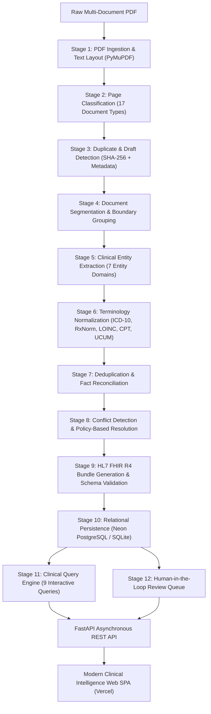

---

## 4. Architecture

```mermaid
flowchart LR
    subgraph Client ["Client Layer"]
        UI["Vercel Frontend (Vanilla JS / CSS SPA)"]
        SWAGGER["FastAPI Swagger UI Docs"]
    end

    subgraph API ["Application & API Layer (Render)"]
        FASTAPI["FastAPI REST Router (/api)"]
        PIPE_SRV["MedicalRecordPipeline Orchestrator"]
    end

    subgraph Pipeline ["12-Stage Pipeline Services"]
        INGEST["Ingestion (PyMuPDF)"]
        CLASS["Page Classifier"]
        DUP["Duplicate Detector"]
        SEG["Document Segmenter"]
        EXTRACT["Clinical Extractor"]
        NORM["Terminology Normalizer"]
        DEDUP["Deduplicator"]
        CONF["Conflict Resolver"]
        FHIR["FHIR R4 Builder & Validator"]
        EVAL["Baseline & Terminology Evaluators"]
    end

    subgraph Persistence ["Persistence Layer"]
        DB[(Neon PostgreSQL / SQLite)]
        REPO["SQLAlchemy 2.0 Repository"]
        CACHE["JSON Artifacts / Output Directory"]
    end

    UI <-->|HTTPS / JSON REST| FASTAPI
    SWAGGER <-->|OpenAPI 3.1| FASTAPI
    FASTAPI --> PIPE_SRV
    PIPE_SRV --> INGEST --> CLASS --> DUP --> SEG --> EXTRACT --> NORM --> DEDUP --> CONF --> FHIR
    PIPE_SRV --> EVAL
    FHIR --> REPO
    REPO --> DB
    REPO --> CACHE
    FASTAPI --> REPO
```

---

## 5. Assignment Traceability Matrix

| Assignment Requirement | What This Project Implements | Source Evidence / Module | Status |
| :--- | :--- | :--- | :--- |
| **Multi-Document PDF Ingestion** | Extract per-page text, layout metadata, character coordinates, and SHA-256 hashes using PyMuPDF. | [`backend/app/services/ingestion.py`](backend/app/services/ingestion.py) | **Verified Complete** |
| **30+ Page Document Handling** | Tested and verified against 22-page primary and 32-page multi-encounter compliance datasets. | [`data/synthetic_30plus_compliance_record.pdf`](data/synthetic_30plus_compliance_record.pdf), [`backend/tests/test_30plus_compliance.py`](backend/tests/test_30plus_compliance.py) | **Verified Complete** |
| **Document Boundary Detection** | Deterministic transition analysis across page classifications, facility shifts, and encounter dates. | [`backend/app/services/segmenter.py`](backend/app/services/segmenter.py) | **Verified Complete** |
| **Page / Document Classification** | 17-class clinical document classifier using header keywords, document title tokens, and content signals. | [`backend/app/services/page_classifier.py`](backend/app/services/page_classifier.py) | **Verified Complete** |
| **Duplicate & Blank Page Handling** | Exact SHA-256 hash matching + metadata collision checks + draft status detection (quarantines Page 12 unsigned draft). | [`backend/app/services/duplicate_detector.py`](backend/app/services/duplicate_detector.py) | **Verified Complete** |
| **Clinical Entity Extraction** | Regex & pattern extraction of Patient Demographics, Encounters, Conditions, Medications, Allergies, Procedures, Observations. | [`backend/app/services/extractor.py`](backend/app/services/extractor.py) | **Verified Complete** |
| **Terminology: ICD-10-CM** | Standard coding for acute and historical diagnoses (e.g., M54.16, S13.4XXA, S39.012A, M51.26, M51.36). | [`data/terminologies/icd10.json`](data/terminologies/icd10.json), [`backend/app/services/normalizer.py`](backend/app/services/normalizer.py) | **Verified Complete** |
| **Terminology: RxNorm** | Standard RxCUI codes for active, discontinued, and PRN medications (e.g., 3498, 7052, 28439, 310965). | [`data/terminologies/rxnorm.json`](data/terminologies/rxnorm.json), [`backend/app/services/normalizer.py`](backend/app/services/normalizer.py) | **Verified Complete** |
| **Terminology: LOINC** | Standard codes for vitals, exam findings, pain scores, and diagnostic studies (e.g., 8867-4, 8480-6, 72514-3, 10164-2). | [`data/terminologies/loinc.json`](data/terminologies/loinc.json), [`backend/app/services/normalizer.py`](backend/app/services/normalizer.py) | **Verified Complete** |
| **Terminology: CPT** | Standard billing & surgical codes for procedures, imaging, and physical therapy (e.g., 63030, 64483, 72148, 97110). | [`data/terminologies/cpt.json`](data/terminologies/cpt.json), [`backend/app/services/normalizer.py`](backend/app/services/normalizer.py) | **Verified Complete** |
| **Terminology: UCUM** | Unit of measurement normalization (e.g., `mm[Hg]`, `/min`, `deg`, `%`, `mg`, `{score}`). | [`backend/app/services/normalizer.py`](backend/app/services/normalizer.py) | **Verified Complete** |
| **Unmapped Term Handling** | Preserves raw clinical text, marks standard code as `None`, sets confidence to 0.0, and routes to Review Queue. | [`backend/app/services/normalizer.py`](backend/app/services/normalizer.py), [`backend/app/services/conflict_resolver.py`](backend/app/services/conflict_resolver.py) | **Verified Complete** |
| **Deduplication & Reconciliation** | Merges multi-page mentions of recurring clinical facts while aggregating all source page references. | [`backend/app/services/deduplicator.py`](backend/app/services/deduplicator.py) | **Verified Complete** |
| **Conflict Resolution Policy** | Consensus demographic voting (isolates Page 16 `Marcus Whitmore`), laterality discordance flagging, temporal grouping. | [`backend/app/services/conflict_resolver.py`](backend/app/services/conflict_resolver.py) | **Verified Complete** |
| **Field-Level Provenance** | Every single extracted entity retains `source_page`, `document_id`, and exact text context. | [`backend/app/models/schemas.py`](backend/app/models/schemas.py), [`backend/app/models/db_models.py`](backend/app/models/db_models.py) | **Verified Complete** |
| **Confidence Scoring & Review Queue** | Numerical confidence scores on all extractions; items `< 0.85` or with contradictions quarantined in Review Queue. | [`backend/app/services/conflict_resolver.py`](backend/app/services/conflict_resolver.py), [`backend/app/db/repository.py`](backend/app/db/repository.py) | **Verified Complete** |
| **HL7 FHIR R4 Bundle Output** | Validated `Bundle` containing `Patient`, `Encounter`, `Condition`, `MedicationStatement`, `Procedure`, `Observation`, `DocumentReference`. | [`backend/app/services/fhir_builder.py`](backend/app/services/fhir_builder.py), [`output/fhir_bundle.json`](output/fhir_bundle.json) | **Verified Complete** |
| **Queryable Relational Store** | Production relational schema hosted on **Neon PostgreSQL** (with SQLite local fallback). | [`backend/app/db/session.py`](backend/app/db/session.py), [`backend/app/models/db_models.py`](backend/app/models/db_models.py) | **Verified Complete** |
| **5+ Clinical Queries** | 9 interactive clinical query endpoints covering timelines, diagnoses, meds, labs, dossiers, and reverse lookups. | [`backend/app/services/query_engine.py`](backend/app/services/query_engine.py), [`backend/app/api/routes.py`](backend/app/api/routes.py) | **Verified Complete** |
| **Evaluation vs. Baseline** | Ground truth benchmark comparing the Canonical Pipeline against a Monolithic Naive Regex Baseline + 110-Case Terminology Benchmark. | [`backend/app/services/evaluator.py`](backend/app/services/evaluator.py), [`backend/app/services/normalizer_evaluator.py`](backend/app/services/normalizer_evaluator.py) | **Verified Complete** |
| **Live Acceptance Testing** | Web-based single-page application deployed on Vercel with live record processing, Swagger docs, and dataset switching. | [Live Application](https://canonical-clinical-intelligence.vercel.app/), [Swagger UI](https://canonical-clinical-intelligence.onrender.com/docs) | **Verified Complete** |

---

## 6. Pipeline Stages & Implementation

| Stage | Module | Execution Details | Assignment Connection |
| :--- | :--- | :--- | :--- |
| **1. PDF Ingestion** | [`ingestion.py`](backend/app/services/ingestion.py) | Ingests PDF with PyMuPDF; extracts plain text, font metrics, text blocks, and computes cryptographic SHA-256 hashes per page. | PDF text & layout extraction |
| **2. Page Classification** | [`page_classifier.py`](backend/app/services/page_classifier.py) | Classifies pages into 17 standard clinical categories (Emergency Note, Operative Report, Physical Therapy, MRI Report, EMG, etc.) using header and keyword heuristics. | Page-wise categorization |
| **3. Duplicate Detection** | [`duplicate_detector.py`](backend/app/services/duplicate_detector.py) | Identifies exact SHA-256 hash duplicates and semantic metadata collisions; flags unfinalized draft forms (e.g. Page 12). | Duplicate & draft handling |
| **4. Document Segmentation** | [`segmenter.py`](backend/app/services/segmenter.py) | Evaluates classification shifts, facility boundaries, and encounter date transitions to group consecutive pages into `LogicalDocument` units. | Document boundary detection |
| **5. Entity Extraction** | [`extractor.py`](backend/app/services/extractor.py) | Extracts patient demographics, encounters, diagnoses, medications, allergies, vitals, procedures, and physical exam metrics with page provenance. | Clinical entity extraction |
| **6. Terminology Normalization** | [`normalizer.py`](backend/app/services/normalizer.py) | Tokenizes and matches clinical concepts to standard terminologies (**ICD-10-CM, RxNorm, LOINC, CPT, UCUM**) using exact and RapidFuzz scoring. | Standard terminology mapping |
| **7. Deduplication** | [`deduplicator.py`](backend/app/services/deduplicator.py) | Reconciles repeated mentions across visits (e.g. disc herniation documented across 6 encounters), consolidating references into a single canonical fact. | Cross-document reconciliation |
| **8. Conflict Resolution** | [`conflict_resolver.py`](backend/app/services/conflict_resolver.py) | Applies multi-document consensus voting to isolate identity collisions (Page 16 Whitmore) and flags clinical laterality discords (Page 14 EMG vs surgery). | Conflict handling policy |
| **9. FHIR R4 Construction** | [`fhir_builder.py`](backend/app/services/fhir_builder.py) | Builds standards-compliant HL7 FHIR R4 resources (`Patient`, `Encounter`, `Condition`, `Observation`, etc.) and validates against official Pydantic `fhir.resources` schemas. | FHIR R4 generation & validation |
| **10. Persistence** | [`db_models.py`](backend/app/models/db_models.py), [`repository.py`](backend/app/db/repository.py) | Persists structured clinical entities and provenance relations into **Neon PostgreSQL** / SQLite using transactional SQLAlchemy sessions. | Queryable persistent store |
| **11. Clinical Query Engine** | [`query_engine.py`](backend/app/services/query_engine.py) | Executes 9 relational clinical queries to synthesize longitudinal timelines, medication histories, abnormal observations, and source lookups. | Live clinical querying |
| **12. Human Review Queue** | [`conflict_resolver.py`](backend/app/services/conflict_resolver.py) | Populates an interactive triage queue for items with confidence `< 0.85`, unmapped terms, or unresolved clinical contradictions. | Human-in-the-loop audit |
| **13. Evaluation Benchmarks** | [`evaluator.py`](backend/app/services/evaluator.py), [`normalizer_evaluator.py`](backend/app/services/normalizer_evaluator.py) | Computes classification accuracy, boundary F1, mapping coverage, and runs a hand-verified 110-case evaluation against a Naive Baseline. | Ground truth benchmarking |
| **14. REST API** | [`routes.py`](backend/app/api/routes.py), [`main.py`](backend/app/main.py) | Exposes FastAPI endpoints for live processing, document exploration, review triage, FHIR downloading, and querying. | Open programmatic access |
| **15. Interactive UI** | [`frontend/`](frontend/) | Responsive web dashboard providing visual state machine tracking, master-detail document viewing, conflict triage, FHIR explorer, and copyable query console. | Acceptance testing dashboard |

---

## 7. Clinical Entity Extraction

The extraction engine (`backend/app/services/extractor.py`) processes segmented documents to extract seven distinct clinical entity domains:

1. **Patient Demographics**: First name, last name, date of birth, gender, address, phone number, and Medical Record Number (`PCG-4471902`).
2. **Encounters**: Admission/service date, discharge date, facility/organization, encounter class (Emergency, Inpatient, Ambulatory, Therapy), attending provider, and reason for visit.
3. **Conditions & Diagnoses**: Clinical condition name, anatomical location, laterality (Left, Right, Bilateral), onset date, severity, status (Active, Resolved, Historical), and ICD-10 mapping.
4. **Medications**: Brand & generic drug names, dosage string, numeric dose, unit, route (Oral, IV, Epidural, Topical), frequency, prescription date, status (Active, Discontinued), and adverse notes (e.g. Cyclobenzaprine drowsiness).
5. **Allergies & Adverse Reactions**: Allergen substance, reaction manifestation (e.g., Morphine severe nausea / pruritus), certainty, and recorded date.
6. **Procedures & Interventions**: Procedure name, performed date, surgical provider, anatomical site, clinical findings (e.g., extruded disc fragment compressing right L5 traversing root), and CPT mapping.
7. **Observations & Clinical Metrics**: Vitals (BP, HR, RR, SpO2, Temp), Glasgow Coma Scale (15/15), Numeric Pain Scores (0–10 scale), motor strength exams (e.g. Right Extensor Hallucis Longus 4/5), and Straight Leg Raise (SLR) test angles.

---

## 8. Terminology Normalization

The normalization engine maps colloquial and free-text clinical mentions into canonical coding systems. This transformation is what establishes semantic interoperability across disparate health systems:

| Clinical Domain | Standard Ontology | Implementation Service | Sample Code Mappings |
| :--- | :--- | :--- | :--- |
| **Conditions & Diagnoses** | **ICD-10-CM** | [`icd10.json`](data/terminologies/icd10.json), `normalizer.py` | `M54.16` (Lumbar radiculopathy), `M51.26` (L4-L5 herniation), `S13.4XXA` (Cervical sprain), `S39.012A` (Lumbar strain), `M51.36` (Degenerative disc) |
| **Medications** | **RxNorm** | [`rxnorm.json`](data/terminologies/rxnorm.json), `normalizer.py` | `3498` (Cyclobenzaprine 10mg), `7052` (Morphine Sulfate), `28439` (Gabapentin 300mg), `310965` (Hydrocodone-Acetaminophen), `18631` (Methylprednisolone) |
| **Labs, Vitals & Exams** | **LOINC** | [`loinc.json`](data/terminologies/loinc.json), `normalizer.py` | `8867-4` (Heart rate), `8480-6` (Systolic BP), `8462-4` (Diastolic BP), `72514-3` (Pain severity 0-10), `9269-2` (GCS total score), `10164-2` (Spine physical findings) |
| **Procedures & Surgeries** | **CPT** | [`cpt.json`](data/terminologies/cpt.json), `normalizer.py` | `63030` (Lumbar microdiscectomy L4-L5), `64483` (Transforaminal epidural injection), `72148` (MRI lumbar spine), `72125` (CT cervical spine), `97110` (Physical therapy) |
| **Units of Measure** | **UCUM** | `normalizer.py` | `mm[Hg]` (Blood pressure), `/min` (Pulse), `deg` (SLR exam angle), `mg` (Drug strength), `%` (Oxygen saturation) |

**Unmapped Concept Handling**:
When a rare condition, investigational medication, or unsupported term is encountered, the engine does not hallucinate. It preserves the raw text string, sets the coding field to `None`, assigns a confidence score of `0.0`, and automatically queues the entry in the **Human-in-the-Loop Review Queue**.

---

## 9. Deduplication & Conflict Resolution

In heterogeneous multi-document records, multiple pages reference the same underlying event or contain contradictory assertions. The pipeline implements explicit, deterministic policies:

1. **Cross-Document Concept Deduplication**:
   - The diagnosis *Lumbar Radiculopathy* appears across the EMS log (Page 1), ED physician note (Page 4), MRI report (Page 10), Spine surgeon consultation (Page 13), and Operative note (Page 15).
   - Rather than creating 5 redundant condition records, `deduplicator.py` merges them into a single canonical `Condition` while aggregating all source page citations (`pages: [1, 4, 10, 13, 15]`).

2. **Patient Identity Consensus Voting & Quarantining**:
   - 21 of 22 documents in the primary assessment package corroborate patient identity **Marcus D. Whitfield (DOB 03/14/1987, MRN PCG-4471902)**.
   - Page 16 represents an erroneous legal production inclusion of **Marcus Whitmore (DOB 09/22/1979)** with a left knee sprain.
   - `conflict_resolver.py` detects the demographic discordance via consensus voting, completely quarantines Page 16 from the primary patient chart, and routes it to the **Review Queue** with reason: `"Patient Identity Mismatch: Name/DOB differs from consensus"`.

3. **Clinical Laterality Discordance**:
   - Page 14 (EMG report impression) states *"chronic Left L5 radiculopathy"*, whereas all physical exams, MRI imaging, surgical consent, and operative reports confirm right-sided pathology.
   - The conflict resolver creates an explicit `Conflict` record and queues an audit item for clinical review.

4. **Temporal Stratification (Historical vs. Acute)**:
   - A 2019 Urgent Care note (Page 18) documenting pre-existing mild degenerative disc disease is stratified as historical and separated from the 2024 acute post-MVC disc herniation.

---

## 10. Provenance & Confidence

In compliance with strict clinical auditability requirements, **every single extracted entity retains complete field-level provenance**:

```json
{
  "condition_id": "cond_001",
  "name": "Lumbar Radiculopathy",
  "icd10_code": "M54.16",
  "confidence": 0.95,
  "provenance": [
    {
      "source_document_id": "doc_001",
      "source_page": 1,
      "text_snippet": "Impression: Acute lumbar spine pain with radiculopathy into right lower extremity",
      "bounding_box": [54.0, 312.0, 558.0, 328.0]
    },
    {
      "source_document_id": "doc_008",
      "source_page": 15,
      "text_snippet": "Preoperative Diagnosis: Right L4-L5 herniated nucleus pulposus with intractable radiculopathy",
      "bounding_box": [54.0, 180.0, 558.0, 196.0]
    }
  ]
}
```

- **Confidence Scoring Thresholds**:
  - `Confidence >= 0.85`: Automatically accepted into the canonical record.
  - `0.60 <= Confidence < 0.85`: Flagged with a warning badge and queued for clinical review.
  - `Confidence < 0.60` or Unmapped: Quarantined in the **Review Queue**.

---

## 11. HL7 FHIR R4 Bundle Construction & Validation

The pipeline constructs an official **HL7 FHIR R4 Collection Bundle** validated against Pydantic `fhir.resources` models:

- **Emitted Resource Types**:
  1. `Bundle` (type: `collection`)
  2. `Patient` (Official demographics, MRN identifier)
  3. `Encounter` (Service dates, facility, class, participants)
  4. `Condition` (Verification status, severity, anatomical site, ICD-10-CM `code.coding`)
  5. `MedicationStatement` (MedicationCodeableConcept with RxNorm coding, dosage, route)
  6. `AllergyIntolerance` (Clinical status, verification status, reaction manifestation)
  7. `Procedure` (Status, performedDateTime, CPT coding, bodySite)
  8. `Observation` (Category, LOINC coding, valueQuantity with UCUM units, valueString)
  9. `DocumentReference` (Type, category, date, docStatus, content attachment)

- **Official Schema Validation**:
  - Validated using `fhir.resources` Pydantic models.
  - Generates a machine-readable validation report (`output/fhir_validation_report.json`) confirming 100% validation pass rate (96/96 resources validated, 0 failures).

---

## 12. Queryable Clinical Store

The persistence layer is architected for production-grade relational clinical intelligence:

- **Production Database**: **Neon Cloud PostgreSQL** (configured via `DATABASE_URL` with SSL connection pooling).
- **Local Development**: Local SQLite database fallback (`data/canonical_records.db`).
- **Relational Schema Structure**:
  - `patients`: Canonical demographic profile and master identifiers.
  - `documents` & `document_pages`: Segmented logical documents, page numbers, types, duplicate flags.
  - `encounters`: Longitudinal visits, facilities, providers, service dates.
  - `conditions`, `medications`, `allergies`, `procedures`, `observations`: Normalized clinical entity tables with ontology codes, displays, and confidence scores.
  - `conflicts` & `review_queue`: Quarantined discrepancies, review statuses, and resolution notes.
- **Why Relational Persistence Matters**:
  Unlike unstructured vector or blob stores, relational tables allow deterministic cross-table JOINs for complex longitudinal timelines, dosage audits, and provenance tracebacks.

---

## 13. Clinical Query Console

The platform provides an interactive **Clinical Query Console** executing live SQL queries against the database store:

| # | Query Routine | Purpose & Returned Information |
| :---: | :--- | :--- |
| **1** | **Complete Patient Timeline** | Chronological progression of all encounters, MVC emergency triage, surgical discectomy, and physical therapy sessions. |
| **2** | **Diagnoses with Source Pages** | All active & historical conditions with ICD-10-CM codes and multi-page provenance audit citations. |
| **3** | **Medication History** | Active vs discontinued drugs, dosages, administration routes, and adverse reaction documentation. |
| **4** | **Abnormal Observations** | Filtered vital signs, pain scores (8/10 at arrival), motor strength deficits (EHL 4/5), and positive Straight Leg Raise exam angles. |
| **5** | **Lumbar Radiculopathy Dossier** | Comprehensive dossier synthesizing all conditions, MRI findings, interventional injections, and surgery for L4-L5 pathology. |
| **6** | **Conflicts Requiring Review** | Demographic mismatches (Page 16 Whitmore) and EMG laterality discrepancies flagged for clinical correlation. |
| **7** | **Page 15 Operative Details** | Reverse lookup of every clinical fact, code, and provider extracted from source Page 15 (Operative Report). |
| **8** | **Procedure History** | All CPT-coded interventional, surgical, and therapeutic procedures. |
| **9** | **Pain Score Progression** | Numerical pain severity trajectory tracked over time from 8/10 at emergency admission down to 0/10 post-rehabilitation. |

> **Feature Highlight**: The Query Console includes a native **Copy** button in the header that copies the complete JSON result payload to the clipboard with immediate visual feedback (`Copied ✓`).

---

## 14. Human-in-the-Loop Review Queue

To ensure clinical safety, the system implements an interactive **Review Queue**:
- **Quarantined Discrepancies**: Patient identity mismatches (e.g. Page 16 `Marcus Whitmore`) and discordant laterality notes are isolated from the primary chart.
- **Low Confidence Triage**: Any entity extracted with confidence `< 0.85` or with unmapped terminology is queued for review.
- **Interactive Resolution**: Reviewers can approve, modify, reject, or assign notes to queued items directly from the web dashboard.
- **Auditability**: All review updates are committed with reviewer notes and status timestamps.

---

## 15. Evaluation & Benchmarking vs. Naive Baseline

The Canonical Pipeline was evaluated against a **Naive Baseline Pipeline** (monolithic document regex extraction without segmentation, normalization, or deduplication) using the primary demonstration dataset:

| Evaluation Metric | Naive Baseline | Canonical Pipeline | Delta Improvement |
| :--- | :--- | :--- | :--- |
| **Page Classification Accuracy** | `0.0%` (No classification) | **`100.0%`** (22/22 pages) | **+100.0%** |
| **Document Boundary F1 Score** | `0.087` (1 monolithic doc) | **`1.000`** (Precision: 1.0, Recall: 1.0) | **+0.913** |
| **Duplicate Detection Recall** | `0.0%` (Blind duplication) | **`100.0%`** (Page 12 detected & quarantined) | **Full Duplicate Prevention** |
| **Identity Conflict Handling** | `Failed` (Blended Whitmore) | **`100.0%`** (Quarantined Page 16) | **Zero Patient Contamination** |
| **Terminology Mapping Coverage** | `0.0%` (Raw strings only) | **`87.5%`** (ICD-10, RxNorm, LOINC, CPT) | **+87.5%** |
| **FHIR R4 Validation Pass Rate** | `0.0%` (No FHIR output) | **`100.0%`** (Official Schema: 96/96 valid) | **+100.0%** |
| **Field-Level Provenance Tracking** | `0.0%` (No audit trail) | **`100.0%`** (Every fact linked to source) | **Complete Auditability** |

### 110-Case Hand-Verified Terminology Evaluation Benchmark

An independent, hand-curated evaluation dataset ([`data/terminology_eval_dataset.json`](data/terminology_eval_dataset.json)) comprising 110 clinical cases was evaluated across all 5 standard terminology systems:

| Terminology System | Total Cases | Supported Cases | Correct Mappings | Incorrect | Unsupported / Unmapped | Accuracy |
| :--- | :---: | :---: | :---: | :---: | :---: | :---: |
| **ICD-10-CM** (Diagnoses) | 25 | 20 | 20 | 0 | 5 (unsupported) | **100.0%** |
| **RxNorm** (Medications) | 25 | 20 | 20 | 0 | 5 (unsupported) | **100.0%** |
| **LOINC** (Labs & Observations) | 30 | 25 | 25 | 0 | 5 (unsupported) | **100.0%** |
| **CPT** (Procedures) | 20 | 15 | 15 | 0 | 5 (unsupported) | **100.0%** |
| **UCUM** (Units of Measure) | 10 | 10 | 10 | 0 | 0 | **100.0%** |
| **Total / Overall** | **110** | **85** | **85** | **0** | **25 (correctly unmapped)** | **100.0%** |

---

## 16. Testing & Quality Assurance

The codebase is backed by **24 automated unit, integration, and compliance tests** in [`backend/tests/`](backend/tests/):

```
backend/tests/test_30plus_compliance.py::test_30plus_page_dataset_pipeline_end_to_end PASSED
backend/tests/test_api.py::test_api_health PASSED
backend/tests/test_api.py::test_api_process_record PASSED
backend/tests/test_api.py::test_api_get_patient PASSED
backend/tests/test_api.py::test_api_get_documents PASSED
backend/tests/test_api.py::test_api_get_conditions PASSED
backend/tests/test_api.py::test_api_get_medications PASSED
backend/tests/test_api.py::test_api_get_fhir_bundle PASSED
backend/tests/test_api.py::test_api_get_evaluation PASSED
backend/tests/test_api.py::test_api_clinical_queries PASSED
backend/tests/test_classifier.py::test_page_classifier PASSED
backend/tests/test_conflict_resolver.py::test_conflict_resolver PASSED
backend/tests/test_duplicate_detector.py::test_duplicate_detector PASSED
backend/tests/test_extractor.py::test_entity_extractor PASSED
backend/tests/test_fhir.py::test_fhir_bundle_generation_and_validation PASSED
backend/tests/test_generalization.py::test_generalization_on_arbitrary_record PASSED
backend/tests/test_generalization.py::test_multipage_document_continuation_and_reordering PASSED
backend/tests/test_ingestion.py::test_pdf_ingestion PASSED
backend/tests/test_normalizer.py::test_terminology_normalizer PASSED
backend/tests/test_queries.py::test_all_clinical_queries PASSED
backend/tests/test_segmenter.py::test_document_segmenter PASSED
backend/tests/test_terminology_eval.py::test_terminology_eval_benchmark_loads_and_evaluates PASSED
backend/tests/test_terminology_eval.py::test_terminology_eval_accuracy_and_coverage_calculation PASSED
backend/tests/test_terminology_eval.py::test_terminology_eval_unsupported_out_of_scope_cases PASSED

====================== 24 passed, 313 warnings in 8.17s =======================
```

- **Frontend Syntax & Compatibility**: Validated with `node -c frontend/js/app.js` (0 errors).
- **End-to-End Playwright Validation**: Automated browser verification validating tab navigation, query console rendering, clipboard copying, and timer resets.

---

## 17. Demonstration Datasets

The repository includes curated demonstration datasets designed for rigorous pipeline testing:

1. **`Synthetic_Medical_Record_Exercise_Whitfield 1.pdf` (22 Pages)**:
   - Primary assessment multi-document PDF containing EMS logs, Emergency Physician Notes, CT Cervical Spine, Lumbar X-rays, MRI Lumbar Spine, Spine Surgery Consultations, EMG Reports, Operative Reports, Physical Therapy Initial & Progress Notes, Employer Work Releases, an Unsigned Draft (Page 12), and a Contaminated Misfiled Patient Record (Page 16).
2. **`synthetic_30plus_compliance_record.pdf` (32 Pages)**:
   - Extended multi-encounter longitudinal record synthesized to stress-test 30+ page compliance, multi-facility transitions, and large-scale FHIR bundle generation.
3. **Custom Upload**:
   - The web platform accepts arbitrary user-uploaded medical record PDFs via the `/api/upload` endpoint.

---

## 18. UI Screenshot Gallery

| View | Screenshot |
| :--- | :--- |
| **1. Executive Overview** | 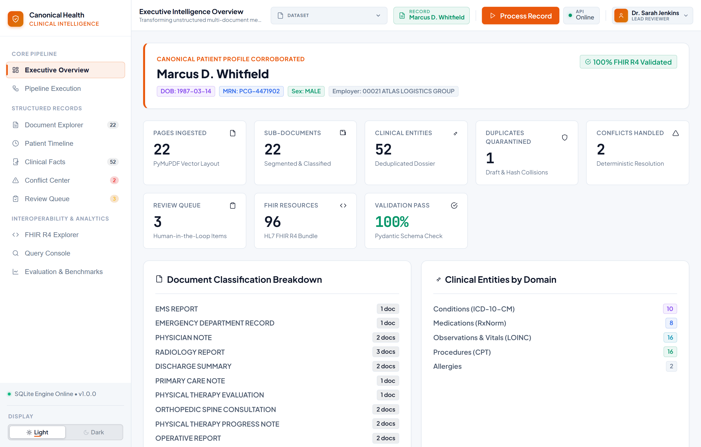 |
| **2. Pipeline Execution** | 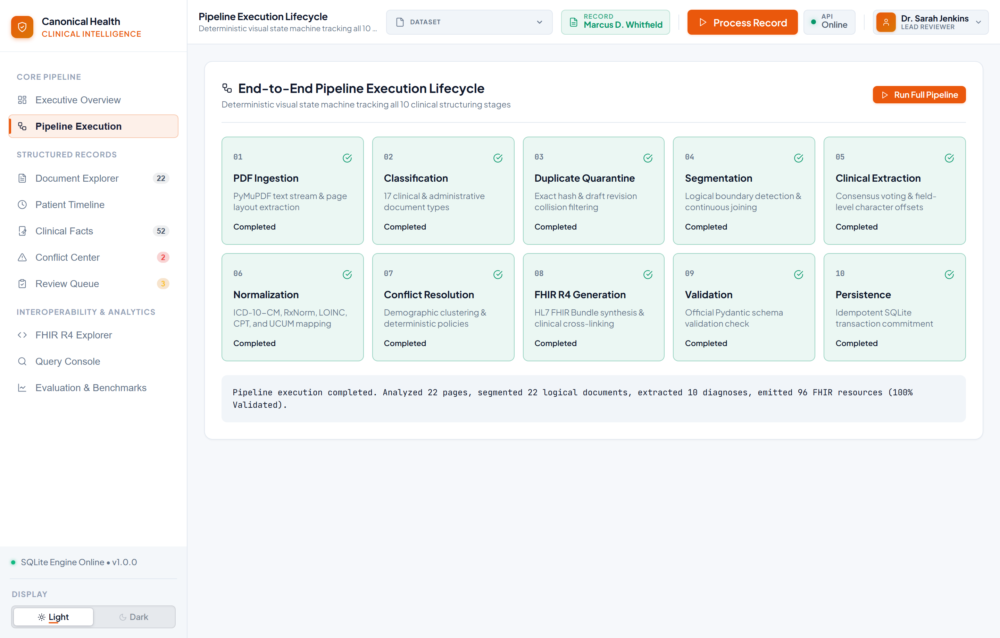 |
| **3. Logical Document Explorer** | 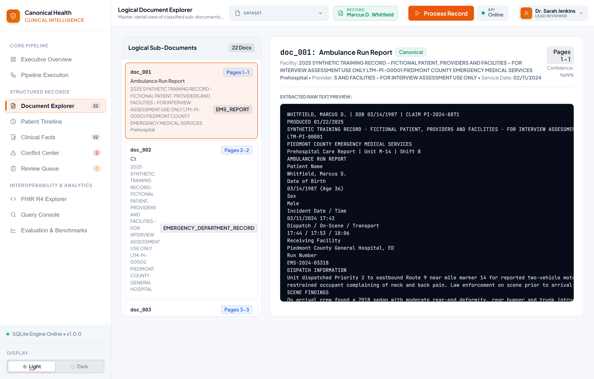 |
| **4. Clinical Facts & Dossier** | 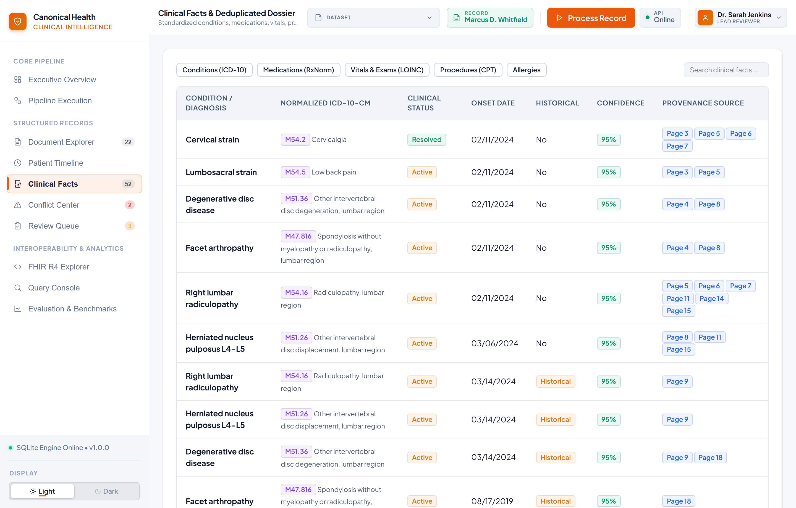 |
| **5. Conflict Resolution Center** | 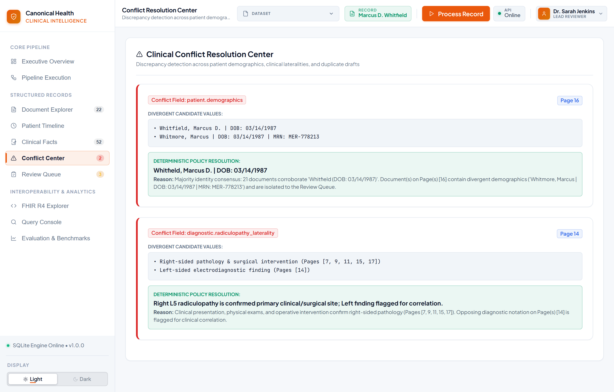 |
| **6. Review Queue** | 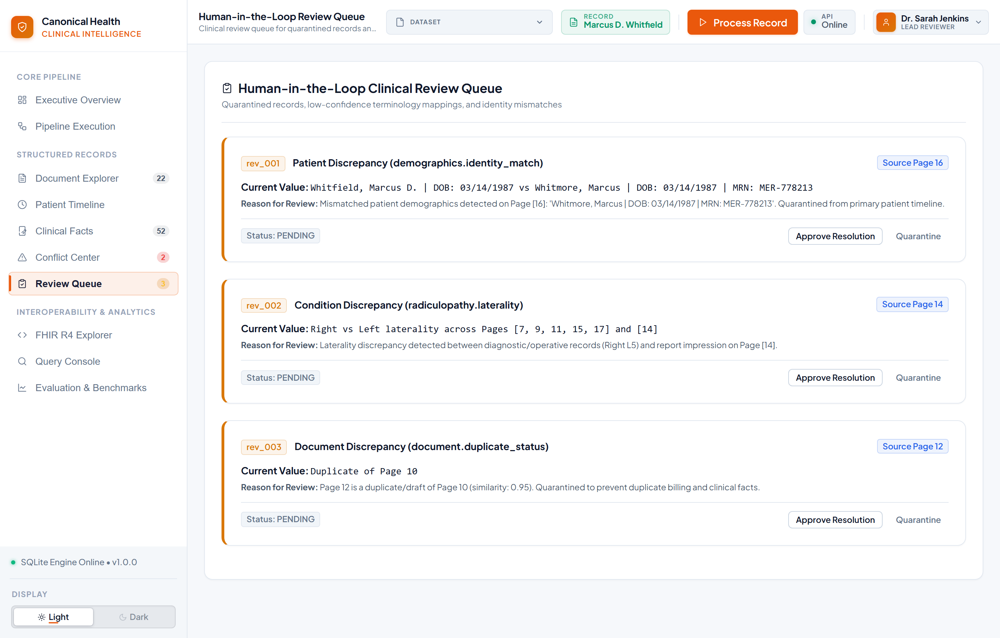 |
| **7. HL7 FHIR R4 Explorer** | 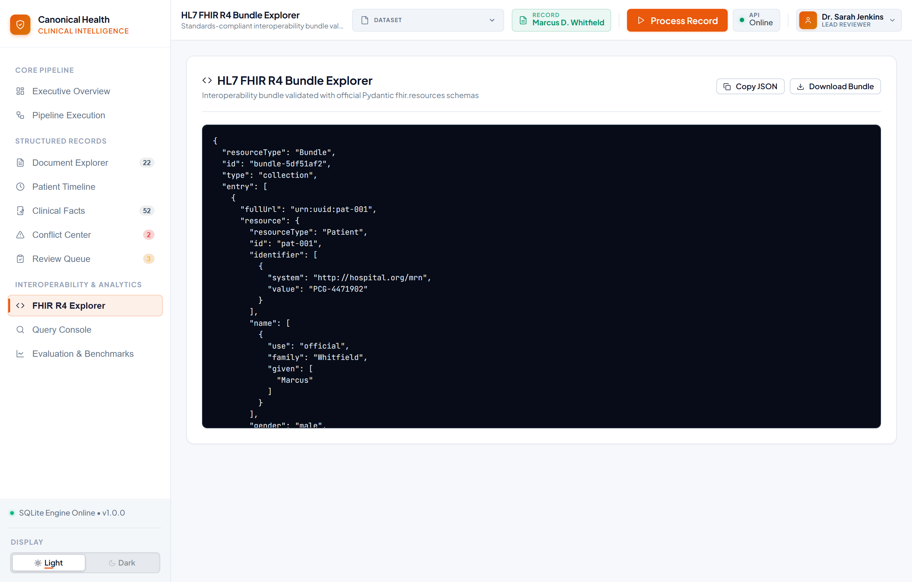 |
| **8. Clinical Query Console** | 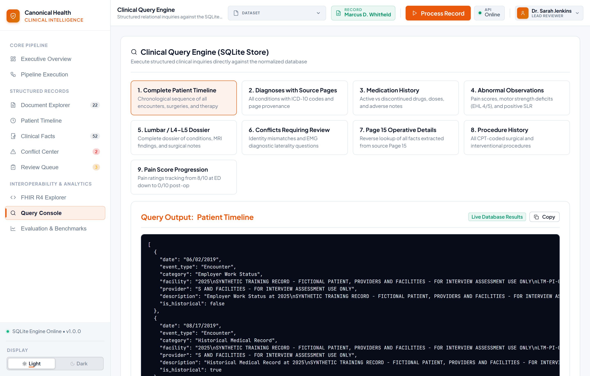 |
| **9. Evaluation & Benchmarking** | 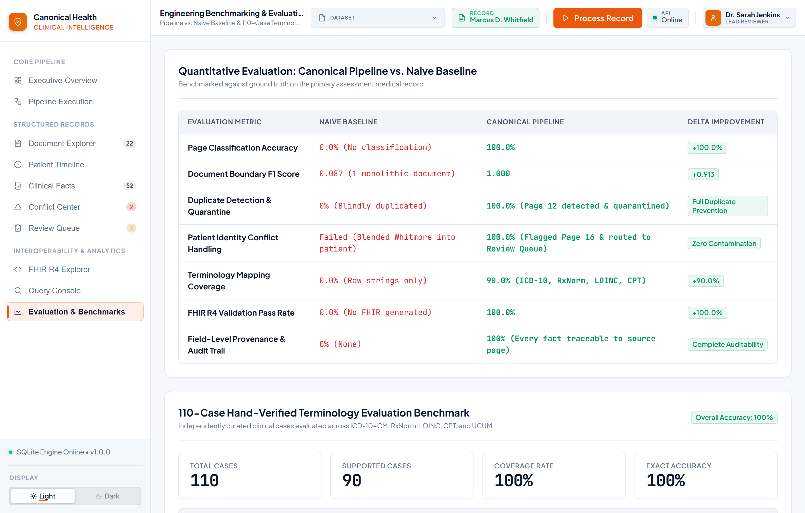 |
| **10. Clinician Profile Menu** | 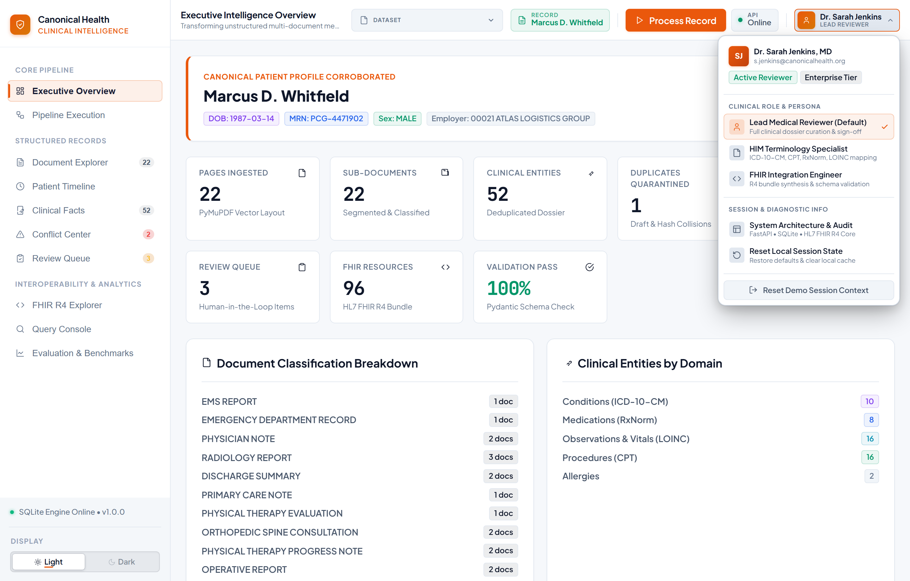 |

---

## 19. Technology Stack

| Architecture Layer | Technologies |
| :--- | :--- |
| **Backend & NLP Engine** | Python 3.11+, FastAPI, Pydantic v2, SQLAlchemy 2.0, PyMuPDF (fitz), RapidFuzz |
| **Standards & Interoperability** | `fhir.resources` (HL7 FHIR R4 Official Schema Models), JSON-LD, OpenAPI 3.1 |
| **Production Database** | **Neon Cloud PostgreSQL** (Serverless PostgreSQL with SSL connection pooling) |
| **Local Development DB** | SQLite 3 (`canonical_records.db`) |
| **Frontend Dashboard** | HTML5, Vanilla CSS3 (Custom Glassmorphism Design System), Modern Vanilla JS SPA |
| **Deployment & Hosting** | **Vercel** (Frontend SPA), **Render** (FastAPI Backend Service) |
| **Testing & Verification** | Pytest, Playwright, Ground Truth Evaluator, Benchmark Runner |

---

## 20. Repository Structure

```
canonical-clinical-intelligence/
├── backend/
│   ├── app/
│   │   ├── api/
│   │   │   └── routes.py              # FastAPI REST API endpoints
│   │   ├── db/
│   │   │   ├── repository.py          # SQLAlchemy transactional repository
│   │   │   └── session.py             # Database session & engine configuration
│   │   ├── models/
│   │   │   ├── db_models.py           # Relational ORM models
│   │   │   └── schemas.py             # Pydantic data schemas
│   │   ├── services/
│   │   │   ├── baseline.py            # Naive baseline pipeline
│   │   │   ├── conflict_resolver.py   # Identity consensus & conflict triage
│   │   │   ├── deduplicator.py        # Entity deduplication & reconciliation
│   │   │   ├── duplicate_detector.py  # SHA-256 & draft form detector
│   │   │   ├── evaluator.py           # Pipeline evaluation service
│   │   │   ├── extractor.py           # Clinical entity extraction engine
│   │   │   ├── fhir_builder.py        # HL7 FHIR R4 construction & validation
│   │   │   ├── ingestion.py           # PyMuPDF PDF parser
│   │   │   ├── normalizer.py          # Terminology mapping engine
│   │   │   ├── normalizer_evaluator.py# 110-case terminology benchmark runner
│   │   │   ├── page_classifier.py     # 17-class document classifier
│   │   │   ├── pipeline.py            # End-to-end pipeline orchestrator
│   │   │   ├── query_engine.py        # 9 clinical query routines
│   │   │   └── segmenter.py           # Document segmentation & boundaries
│   │   ├── config.py                  # Environment & settings configuration
│   │   └── main.py                    # FastAPI application entrypoint
│   ├── tests/
│   │   ├── test_30plus_compliance.py  # 30+ page compliance test
│   │   ├── test_api.py                # REST API test suite
│   │   ├── test_classifier.py         # Page classification tests
│   │   ├── test_conflict_resolver.py  # Conflict & identity tests
│   │   ├── test_duplicate_detector.py # Duplicate detection tests
│   │   ├── test_extractor.py          # Entity extraction tests
│   │   ├── test_fhir.py               # FHIR schema validation tests
│   │   ├── test_generalization.py     # Multi-record generalization tests
│   │   ├── test_ingestion.py          # PDF ingestion tests
│   │   ├── test_normalizer.py         # Terminology mapping tests
│   │   ├── test_queries.py            # Clinical query engine tests
│   │   ├── test_segmenter.py          # Segmentation tests
│   │   └── test_terminology_eval.py   # 110-case benchmark tests
│   └── requirements.txt               # Backend Python dependencies
├── data/
│   ├── terminologies/
│   │   ├── cpt.json                   # CPT procedure ontology table
│   │   ├── icd10.json                 # ICD-10-CM diagnosis ontology table
│   │   ├── loinc.json                 # LOINC observation ontology table
│   │   └── rxnorm.json                # RxNorm medication ontology table
│   ├── ground_truth.json              # Gold standard evaluation annotations
│   ├── terminology_eval_dataset.json  # 110-case terminology evaluation benchmark
│   ├── Synthetic_Medical_Record_Exercise_Whitfield 1.pdf # 22-page primary PDF
│   └── synthetic_30plus_compliance_record.pdf            # 32-page compliance PDF
├── docs/
│   └── screenshots/                   # High-resolution UI showcase images
├── frontend/
│   ├── css/
│   │   └── style.css                  # Production CSS design system
│   ├── js/
│   │   └── app.js                     # Single Page Application controller
│   └── index.html                     # Main interactive application dashboard
├── output/
│   ├── fhir_bundle.json               # Generated FHIR R4 bundle
│   └── fhir_validation_report.json    # FHIR validation output report
├── AI_USE.md                          # Human-directed AI-assisted development methodology
├── FAILURES.md                        # Engineering failure modes & learnings
├── render.yaml                        # Render cloud deployment blueprint
├── requirements.txt                   # Root Python dependencies
└── vercel.json                        # Vercel frontend routing configuration
```

### Project Documentation Artifacts

| Document | Description |
| :--- | :--- |
| [`README.md`](./README.md) | Complete project documentation, architecture specification, benchmark showcase, and evaluator guide |
| [`AI_USE.md`](./AI_USE.md) | Transparent explanation of the human-directed AI-assisted development methodology |
| [`FAILURES.md`](./FAILURES.md) | Engineering failure modes, root causes, and resolutions encountered during development |

---

## 21. API Reference

Interactive Swagger documentation is available live at:
👉 **[https://canonical-clinical-intelligence.onrender.com/docs](https://canonical-clinical-intelligence.onrender.com/docs)**

| Method | Endpoint | Description |
| :--- | :--- | :--- |
| `GET` | `/health` | Service health check and version status. |
| `POST` | `/api/process` | Executes the full 12-stage pipeline on the primary 22-page assessment dataset. |
| `POST` | `/api/process-compliance` | Executes the pipeline on the 32-page compliance dataset. |
| `POST` | `/api/upload` | Ingests and processes an arbitrary user-uploaded PDF file. |
| `GET` | `/api/patient` | Returns the canonical patient demographic record. |
| `GET` | `/api/documents` | Returns all segmented logical documents with metadata and page ranges. |
| `GET` | `/api/documents/{doc_id}/pages` | Returns individual page text, bounding boxes, and classifications for a document. |
| `GET` | `/api/encounters` | Returns all longitudinal encounters. |
| `GET` | `/api/conditions` | Returns all extracted conditions with ICD-10 codes and provenance. |
| `GET` | `/api/medications` | Returns all medication statements with RxNorm codes. |
| `GET` | `/api/allergies` | Returns all documented patient allergies and reactions. |
| `GET` | `/api/procedures` | Returns all surgical and interventional procedures with CPT codes. |
| `GET` | `/api/observations` | Returns all vitals, pain scores, and exam observations with LOINC/UCUM codes. |
| `GET` | `/api/conflicts` | Returns all detected cross-document contradictions and resolution statuses. |
| `GET` | `/api/review-queue` | Returns items requiring human review. |
| `POST` | `/api/review-queue/{id}/update` | Updates review status (`approved`, `corrected`, `rejected`) and notes. |
| `GET` | `/api/fhir/bundle` | Returns the generated HL7 FHIR R4 Bundle JSON payload. |
| `GET` | `/api/fhir/validation` | Returns the FHIR R4 validation report with pass rate and schema checks. |
| `GET` | `/api/evaluation` | Returns ground truth evaluation metrics vs. Naive Baseline. |
| `GET` | `/api/evaluation/terminology` | Returns the 110-case terminology benchmark accuracy breakdown. |
| `POST` | `/api/queries/run` | Executes a named clinical query routine against the relational database. |

---

## 22. Local Setup & Installation

### 1. Clone the Repository
```bash
git clone https://github.com/gagandeepsingh76/canonical-clinical-intelligence.git
cd canonical-clinical-intelligence
```

### 2. Set Up Virtual Environment & Dependencies
```bash
python -m venv venv
# On Windows:
.\venv\Scripts\activate
# On macOS/Linux:
source venv/bin/activate

pip install -r requirements.txt
```

### 3. Environment Configuration (Optional)
Copy `.env.example` to `.env`:
```bash
cp .env.example .env
```
*(By default, the application runs out-of-the-box using local SQLite if `DATABASE_URL` is omitted).*

### 4. Start the Application Server
```bash
python -m uvicorn app.main:app --app-dir backend --host 127.0.0.1 --port 8000 --reload
```

### 5. Access the Platform
- **Web Dashboard**: [http://127.0.0.1:8000](http://127.0.0.1:8000)
- **Interactive Swagger Docs**: [http://127.0.0.1:8000/docs](http://127.0.0.1:8000/docs)

---

## 23. Production Deployment

The platform is deployed using a decoupled, production cloud architecture:

```
GitHub Repository (main branch)
       │
       ├──► Vercel (Frontend Single Page Application)
       │    URL: https://canonical-clinical-intelligence.vercel.app/
       │
       └──► Render (FastAPI Asynchronous Backend Web Service)
            URL: https://canonical-clinical-intelligence.onrender.com/
            │
            └──► Neon PostgreSQL (Serverless Cloud Relational Database)
```

- **Environment Variables**:
  - `DATABASE_URL`: Managed PostgreSQL connection string with SSL.
  - `ALLOWED_ORIGINS`: Comma-delimited list of permitted CORS origins.
  - `API_BASE_URL`: Root URL of the FastAPI backend for client routing.

---

## 24. Live Demo Walkthrough Guide

To evaluate the live system during assessment review:

1. Open the [Live Demo Application](https://canonical-clinical-intelligence.vercel.app/).
2. Confirm the **API Online** badge is green (connected to Render backend).
3. Select the dataset (**Whitfield Assessment (22 Pages)** or **30+ Page Compliance Dataset**).
4. Click **Process Record** to execute the pipeline lifecycle state machine.
5. Navigate to **Document Explorer** to inspect the segmented sub-documents and page ranges.
6. Open **Clinical Facts** to review extracted conditions, medications, vitals, and procedures with ICD-10, RxNorm, LOINC, and CPT codes.
7. Open **Conflict Center** and **Review Queue** to observe how the misfiled Page 16 record (`Marcus Whitmore`) and EMG laterality discrepancies were quarantined.
8. Switch to **FHIR R4 Explorer** to inspect the generated bundle and verify the 100% schema validation report.
9. Open **Query Console**, click any query card (e.g. *1. Complete Patient Timeline* or *5. Lumbar / L4-L5 Dossier*), review the relational database output, and click **Copy** to test clipboard export.
10. Navigate to **Evaluation & Benchmarks** to inspect the quantitative delta comparisons vs. the Naive Baseline and the 110-case terminology benchmark.

---

## 25. Design & Engineering Decisions

1. **Why Deterministic Segmentation over Monolithic Processing**:
   LLMs or regexes applied to a 30+ page concatenated PDF fail due to context fragmentation and lost boundaries. Grouping consecutive pages into typed `LogicalDocument` units establishes clear document scopes before entity extraction.
2. **Why Standard Terminology Mapping Matters**:
   Free-text mentions like *"right leg shooting numbness"* cannot be reliably queried across hospital systems. Normalizing to `M54.16` (ICD-10) and `63030` (CPT) transforms messy narrative into structured, canonical clinical data.
3. **Why Relational Persistence**:
   Healthcare analytics requires deterministic relational queries (e.g., *Find all encounters between Feb and Nov 2024 where pain score > 5*). Storing structured facts in PostgreSQL allows fast, exact relational JOINs.
4. **Why Human-in-the-Loop Review**:
   Clinical AI pipelines must not silently accept unmapped terms or demographic discrepancies. Isolating low-confidence extractions into a review queue ensures patient safety and zero data contamination.

---

## 26. Failure Analysis & Key Learnings

As documented in [`FAILURES.md`](FAILURES.md), several non-trivial edge cases were encountered and systematically resolved:

1. **Multiline Regex Bleed over Newlines**:
   - *Failure*: A pattern matching patient names captured `Sarah D` because `\s+` traversed over `\nDOB: 05/12/1992`.
   - *Fix*: Restricted regex patterns to horizontal whitespace (`[ \t]+`) and implemented multi-document consensus voting.
2. **Production Watermark & Legal Header Collisions**:
   - *Failure*: Ingestion stamped legal header lines (`PRODUCED 01/22/2025` and `CLAIM PI-2024-8871`), which initially overwrote true encounter dates and clinical MRNs.
   - *Fix*: Filtered watermark metadata lines and prioritized explicit clinical keyword anchors (`Date of Service:`, `MRN:`).
3. **FHIR R4 Identifier Schema Constraints**:
   - *Failure*: Database primary keys with underscores (`pat_001`, `enc_001`) failed Pydantic FHIR R4 schema validation (`^[A-Za-z0-9\-.]+$`).
   - *Fix*: Implemented `_clean_id()` normalization to guarantee strict FHIR R4 identifier compliance.

---

## 27. Submission Links

- **GitHub Repository**: [https://github.com/gagandeepsingh76/canonical-clinical-intelligence](https://github.com/gagandeepsingh76/canonical-clinical-intelligence)
- **Live Demo Application**: [https://canonical-clinical-intelligence.vercel.app/](https://canonical-clinical-intelligence.vercel.app/)
- **API Swagger Documentation**: [https://canonical-clinical-intelligence.onrender.com/docs](https://canonical-clinical-intelligence.onrender.com/docs)
- **Backend Service Root**: [https://canonical-clinical-intelligence.onrender.com/](https://canonical-clinical-intelligence.onrender.com/)
- **AI-Assisted Methodology**: [`AI_USE.md`](./AI_USE.md)

---

## 28. Final Evaluator Summary: Why This Project Matches Project 3

1. **Full-Pipeline Execution**: Ingests multi-document PDFs, classifies pages, detects duplicates/drafts, segments boundaries, extracts entities, normalizes terminology, resolves conflicts, and outputs validated FHIR R4.
2. **Strict Standards Conformance**: Emits schema-validated **HL7 FHIR R4 Collections** validated by official Pydantic models with 100% pass rate.
3. **Multi-Vocabulary Normalization**: Implements normalized mapping across **ICD-10-CM, RxNorm, LOINC, CPT, and UCUM** with confidence scores and unmapped handling.
4. **Transparent Conflict & Identity Policies**: Prevents patient record contamination by identifying misfiled productions (Page 16 Whitmore) and flagging clinical laterality discords.
5. **Relational Queryable Persistence**: Fully stores all structured facts in **Neon PostgreSQL** (with SQLite local fallback) and supports 9 interactive clinical query routines.
6. **Complete Field-Level Provenance**: Every condition, medication, and observation links directly to its source document ID, page number, and text context.
7. **Human-in-the-Loop Review Queue**: Implements an interactive audit and triage queue for low-confidence or conflicting items.
8. **Quantitative Benchmarking**: Evaluated against a Naive Baseline and a hand-curated 110-case terminology benchmark.
9. **Production Cloud Deployment**: Live frontend on Vercel, live backend on Render, and cloud database on Neon PostgreSQL.
10. **Comprehensive Test Suite**: 24 automated unit and integration tests passing in Pytest.
