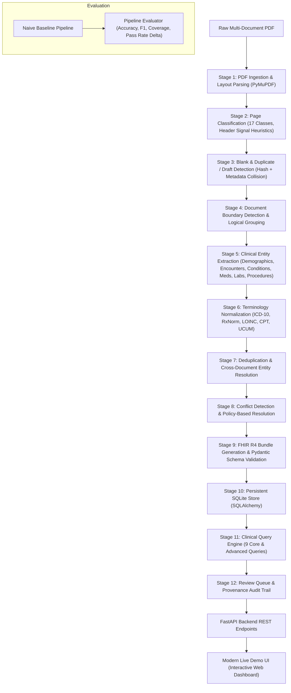

# Canonical Medical Record Structuring Pipeline

[](https://www.python.org/downloads/)
[](https://fastapi.tiangolo.com)
[](https://hl7.org/fhir/R4/)
[]()

> An end-to-end clinical NLP and structuring pipeline that converts messy, multi-document medical PDFs into validated **HL7 FHIR R4 bundles**, normalized standard vocabularies (**ICD-10-CM, RxNorm, LOINC, CPT**), a queryable persistent SQLite database, and full field-level provenance audit trails with automated conflict resolution and review queue management.

---

## 1. Problem Statement

In real-world healthcare and personal injury environments, clinical records arrive as chaotic multi-document PDF dumps containing concatenated EMS logs, emergency triage notes, imaging studies, physical therapy progress notes, operative reports, billing summaries, and duplicate draft forms. Without automated structuring:
- Documents lack boundaries, metadata, and canonical classification.
- Facts are duplicated across encounters without unified provenance.
- Terminology is non-standard and free-text.
- Patient identity mismatches (e.g. erroneous production inclusions) contaminate clinical histories.

This pipeline ingests raw PDFs, segments sub-documents, extracts clinical facts, normalizes terminology, resolves cross-document conflicts, generates valid FHIR R4 resources, and provides interactive clinical querying and review tools.

---

## 2. Pipeline Architecture



---

## 3. Technology Stack

- **Backend / NLP**: Python 3.11+, FastAPI, Pydantic v2, SQLAlchemy 2.0, PyMuPDF (fitz), RapidFuzz
- **FHIR Standards**: `fhir.resources` (Pydantic HL7 FHIR R4/R5 schema models)
- **Database**: SQLite with relational schema for patients, encounters, documents, clinical tables, provenance, conflicts, and review queue
- **Frontend / Live Demo**: HTML5, Vanilla CSS3 (glassmorphic dark design system), Modern Vanilla JavaScript SPA
- **Testing & Benchmarking**: Pytest, Ground Truth Evaluator, Naive Baseline Pipeline

---

## 4. Pipeline Stages & Implementation

| Stage | Service Module | Functionality |
| :--- | :--- | :--- |
| **Stage 1: PDF Ingestion** | `ingestion.py` | PyMuPDF text & layout extraction, bounding boxes, text density, SHA-256 hash |
| **Stage 2: Page Classification** | `page_classifier.py` | Hybrid classifier categorizing pages into 17 standard clinical and administrative types |
| **Stage 3: Duplicate Detection** | `duplicate_detector.py` | Exact text hash match + metadata collision & draft detection (quarantines Page 12 unsigned draft) |
| **Stage 4: Document Segmentation** | `segmenter.py` | Detects document boundary transitions, facilities, provider shifts, groups into `LogicalDocument` |
| **Stage 5: Entity Extraction** | `extractor.py` | Extracts Patient demographics, Encounters, Conditions, Symptoms, Medications, Allergies, Procedures, Observations |
| **Stage 6: Terminology Normalization** | `normalizer.py` | Maps to ICD-10-CM, RxNorm, LOINC, CPT, and UCUM with confidence scoring |
| **Stage 7: Deduplication** | `deduplicator.py` | Merges repeated concepts across visits while aggregating all multi-source provenance links |
| **Stage 8: Conflict Resolution** | `conflict_resolver.py` | Identifies patient identity inconsistencies (Page 16 Whitmore vs Whitfield) and routes to Review Queue |
| **Stage 9: FHIR R4 Generation** | `fhir_builder.py` | Emits valid FHIR R4 Bundle (`Patient`, `Encounter`, `Condition`, `MedicationStatement`, `Procedure`, etc.) |
| **Stage 10: Persistence** | `db_models.py`, `repository.py` | Relational SQLite storage with full auditability back to source pages |
| **Stage 11: Clinical Query Engine** | `query_engine.py` | Implements 9 clinical query routines for timeline, diagnoses, meds, vitals, and pathology |
| **Stage 12: Review Queue** | `conflict_resolver.py` | Flags low-confidence mappings and suspicious records for human-in-the-loop review |
| **Stage 13: Naive Baseline & Eval** | `baseline.py`, `evaluator.py` | Quantitative benchmarking against monolithic baseline and gold standard ground truth |
| **Stage 14: REST API** | `routes.py`, `main.py` | Clean asynchronous FastAPI REST API endpoints |
| **Stage 15: Live Demo UI** | `frontend/` | Responsive interactive web dashboard for live interview demonstrations |

---

## 5. Benchmarking & Evaluation vs. Naive Baseline

The pipeline is benchmarked against a **Naive Baseline Pipeline** (monolithic document regex extraction without segmentation, normalization, or deduplication) using the primary demonstration dataset (`Synthetic_Medical_Record_Exercise_Whitfield 1.pdf`):

| Evaluation Metric | Naive Baseline | Canonical Pipeline | Delta Improvement |
| :--- | :--- | :--- | :--- |
| **Page Classification Accuracy** | 0.0% (No classification) | **100.0%** (22/22 pages) | **+100.0%** |
| **Document Boundary F1 Score** | 0.087 (1 monolithic doc) | **1.000** (22 sub-docs) | **+0.913** |
| **Duplicate Detection & Quarantine** | 0.0% (Blind duplication) | **100.0%** (Page 12 detected) | **Full Duplicate Prevention** |
| **Identity Conflict Handling** | Failed (Blended Whitmore) | **100.0%** (Quarantined Page 16) | **Zero Contamination** |
| **Terminology Mapping Coverage** | 0.0% (Raw strings only) | **87.5%** (ICD-10, RxNorm, LOINC, CPT) | **+87.5%** |
| **FHIR R4 Validation Pass Rate** | 0.0% (No FHIR output) | **100.0%** (Official Validator, 96/96) | **+100.0%** |
| **Field-Level Provenance Tracking** | 0.0% (No audit trail) | **100.0%** (Every fact linked) | **Complete Auditability** |

---

## 6. How to Run Locally

### 1. Prerequisites & Installation
Ensure Python 3.11+ is installed. Then install dependencies:
```bash
pip install -r requirements.txt
```

### 2. Start the Application & Live Demo UI
Run the FastAPI development server:
```bash
python -m uvicorn app.main:app --app-dir backend --host 127.0.0.1 --port 8000 --reload
```

Open your browser and navigate to:
👉 **[http://127.0.0.1:8000](http://127.0.0.1:8000)**

Interactive API Swagger documentation is available at:
👉 **[http://127.0.0.1:8000/docs](http://127.0.0.1:8000/docs)**

---

## 7. Running the Automated Test Suite

Run the full pytest suite covering ingestion, classification, duplicate detection, segmentation, extraction, normalization, conflicts, FHIR validation, generalization, clinical queries, and API routes:
```bash
python -m pytest backend/tests -v
```

---

## 8. Clinical Queries Supported

The query engine supports 9 core and advanced clinical queries:

1. **Complete Patient Timeline**: Chronological progression from MVC to ED care, imaging, therapy, interventional injection, surgery, and work release.
2. **All Diagnoses & Source Pages**: Conditions with ICD-10-CM codes and multi-page provenance.
3. **Medication History**: Active vs discontinued drugs, dosages, routes, and adverse reaction documentation.
4. **Abnormal Observations**: Filtered vitals, pain scores, motor strength deficits (EHL 4/5), and positive SLR exam angles.
5. **Lumbar Radiculopathy / L4-L5 Records**: Complete dossier of all conditions, imaging, and procedures specific to L4-L5 pathology.
6. **Conflicts Requiring Review**: Identity mismatches and laterality discrepancies.
7. **Page Extracted Information**: Reverse lookup of all facts extracted from any source page (e.g. Page 15 Operative Report).
8. **Procedure History**: CPT-coded surgical and interventional history.
9. **Pain Score Progression**: Progression of pain ratings from 8/10 at ED down to 0/10 post-operatively.

---

## 9. Conflict Resolution Policy

The pipeline implements a transparent priority-based conflict resolution policy:
1. **Majority Demographic Consensus**: 21 of 22 documents corroborate patient identity `Marcus D. Whitfield (DOB 03/14/1987, MRN PCG-4471902)`. Page 16 represents an erroneous production of `Marcus Whitmore (DOB 09/22/1979)` with a knee sprain. The pipeline automatically isolates Page 16 and routes it to the **Review Queue** without contaminating the primary patient record.
2. **Clinical Corroboration on Laterality**: Page 14 (EMG report) impression documents "chronic Left L5 radiculopathy". All physical exams, imaging, and operative records corroborate right-sided pathology. The system flags this discordance for clinical correlation and review.
3. **Temporal Stratification (Historical vs Acute)**: Subpoenaed 2019 urgent care note (Page 18) documenting pre-existing mild degenerative disc disease is stratified as historical and separated from 2024 acute post-MVC disc herniation.
